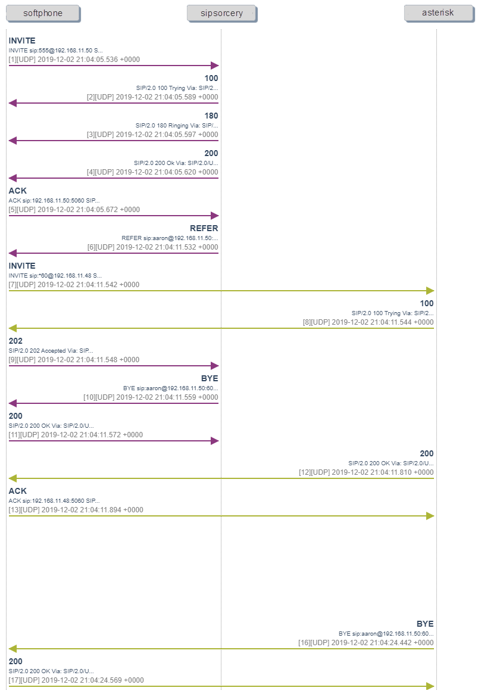

## Call Transfer - Server Initiated

This [example](https://github.com/sipsorcery/sipsorcery/tree/master/examples/CallTransferServer) is similar to the [Call Transfer example](https://github.com/sipsorcery/sipsorcery/tree/master/examples/CallTransfer) with the difference being that in this case the program does not initiate the call. Instead the program waits to receive a call request, answers it and then sometime later when the 't' key is pressed sends a transfer request to the remote call party.

Another difference is this example uses the `SIPUserAgent` instead of the `SIPClientUserAgent`. The `SIPUserAgent` is a combination of the client and server user agents and also understands in dialog requests (things like call hold and transfer). By contrast the `SIPClientUserAgent` considers its job done once the call attempt it answered or rejected.

The type of transfer used is a `Blind Transfer`. The remote call party is requested to place a new call directly. An `Attended Transfer` is where the transferee places the call, does some talking (assumedly) and then bridges the two parties together.

The diagram below represents a typical call flow when using this program. The `softphone` calls the `sipsorcery` program. After answering the `sipsorcery` program transfers the `softphone` by requesting it to place a call to the `asterisk` server.

